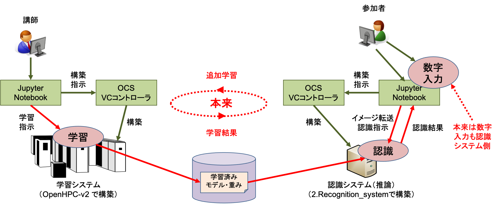

# OpenHPC-v2 テンプレートを利用した手書き数字認識システムの構築

公開中の "OpenHPC-v2" テンプレートを使うと、クラウド上に GPU ノードクラスタを構築することができます。機械学習フレームワークである TensorFlow と Pytorch もサポートしています。

機械学習を使ったアプリケーション環境では、アプリケーションの実行環境では推論のみ行い、学習は別のシステムで行う構成を取ることがよくあります。これは、必要な計算能力やメモリ容量が「学習 >> 推論」であることや、秘密情報を含む学習データをユーザーがアクセスする環境に置きたくないなどの理由によるものです。

本ハンズオンでは、OpenHPC-v2 テンプレートで構築した TensorFlow 環境を学習システムとし、本テンプレートで構築する環境を認識（推論）システムとする、手書き数字認識アプリケーション(MNIST)環境を構築します。なお、ハンズオンでは実習時間の関係で、講師環境に構築した OpenHPC(TensorFlow) 環境で学習したニューラルネットのモデルと重みを使います。

## 利用方法
### OpenHPC-v2 テンプレートによる学習システムの構築と「1.OpenHPC-v2_system」による学習（ハンズオンでは講師環境のみ）
1. [学認クラウドオンデマンド構築サービス公開テンプレートサイト](https://github.com/nii-gakunin-cloud/ocs-templates/)で配布している`OpenHPC-v2`テンプレートを利用して OpenHPC 環境を構築します。OpenHPC-v2 テンプレートは作業別に複数のテンプレートに分割されており、組み合わせることにより目的に沿った環境を構築できます。このハンズオンでは、Docker, GPU, TensorFlow を利用可能な OpenHPC 環境を構築し、学習システムとして使用します。以下の手順で構築します(注：数字の昇順にはなっていません）。

    * 010-パラメータ設定.ipynb
    * 020-OpenHPCの起動.ipynb
    * 032-設定ファイルの編集-GRESの登録.ipynb
    * 071-DockerEngineのインストール.ipynb
    * 051-ユーザの追加.ipynb
    * 152-NGCのコンテナ実行-TensorFlow.ipynb
    
1. 本ハンズオン教材`1.OpenHPC-v2_system`の`MNISTの学習とモデルの保存.ipynb`を実行します。このテンプレートでは、数字認識アプリであるMNISTの学習を実行し、結果のモデル・重みを保存します。OpenHPC-v2 テンプレートの`152-NGCのコンテナ実行-TensorFlow.ipynb`内にも MNIST の学習ステップがありますが、学習結果のモデル・重みを保存していません。このため、本テンプレートでは再度学習し、モデル・重みを`2.Recognition_system`の`data`フォルダに格納します。

### 「2.Recognition_system」による認識システムの構築と認識
1. `2.Recognition_system` を使用して、認識システムを構築します。構成は CPU のみのVCノード１台で、TensorFlow コンテナを実行します。そして、この TensorFlow コンテナ上に、上記学習結果のモデル・重みを展開します。
1. 本 JupyterNotebook上のフリーハンド入力環境で、数字を入力し、1.で構築した認識環境に送り認識します。
1. この環境で、時間がかかるますが、`1.OpenHPC-v2_system` と同じフラットな構成のニューラルネットワークの学習と CNN の学習もできます。

### 環境の削除
ハンズオンを終了する際には、構築した環境を削除します。学習システムは OpenHPC テンプレートの`920-OpenHPC環境の削除.ipynb`で削除し、認識システムは`2.Recognition_system`の`7  環境の削除`で削除します。

