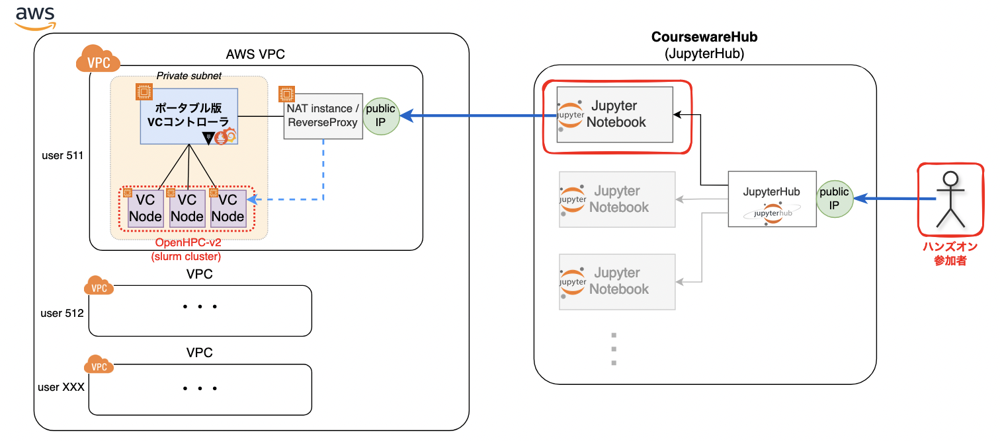

(2024-09 学認クラウドオンデマンド構築サービスセミナー)

# 学認クラウドオンデマンド構築サービスを使用した OpenHPC + Open OnDemand の体験ハンズオン

今回のハンズオンでは、Amazon Web Services (AWS) 上に、HPCクラスタを簡単に利用できるWebポータル「Open OnDemand」を構築します。
Open OnDemandを活用し、ジョブのスケジューリングや実行、Jupyter Notebookを使ったインタラクティブな操作、データの可視化を体験していただきます。

また、クラウド上のHPCクラスタを利用する際の課題や対応策、利用状況について、ディスカッションを通じて共有する予定です。

## 各実習ページへのリンク

### Jupyter Notebook 入門

Jupyter Notebookの基本操作と、NIIクラウド運用チームによるプラグイン拡張の一部について説明します。

- [JupyterNotebook_Introduction.ipynb](JupyterNotebook_Introduction.ipynb)

### Open OnDemandの構築・活用

#### Open OnDemand構築

本日のハンズオンでは事前に [OpenHPC-v2](./OpenHPC-v2/) テンプレートを用いて構築したOpenHPC (SLULRM) クラスタが事前に用意された状態から開始します。

以下のNotebookを順番に実行し、HPCクラスタのマスターノード上にOpen OnDemandを構築します。

- [OpenOnDemand/010-インストール](OpenOnDemand/010-インストール.ipynb)
- [OpenOnDemand/020-フロントエンドのセットアップ](OpenOnDemand/020-フロントエンドのセットアップ.ipynb)
- [OpenOnDemand/030-ジョブ実行環境の設定](OpenOnDemand/030-ジョブ実行環境の設定.ipynb)
- [OpenOnDemand/040-ジョブの実行](OpenOnDemand/040-ジョブの実行.ipynb)

#### Open OnDemandの活用

HPCクラスタとOpen OnDemandを活用し、HPCジョブとしてLinpackベンチマーク、JupyterNotebookサーバを実行します。

- [OpenOnDemand/050-JupyterNotebookのセットアップ](OpenOnDemand/050-JupyterNotebookのセットアップ.ipynb)
- [OpenOnDemand/060-JupyterNotebookジョブの実行](OpenOnDemand/060-JupyterNotebookジョブの実行.ipynb)
- [OpenOnDemand/070-Linpackフロントエンドの作成](OpenOnDemand/070-Linpackフロントエンドの作成.ipynb)
- [OpenOnDemand/080-Linpackの実行](OpenOnDemand/080-Linpackの実行.ipynb)

## ハンズオン環境概略図

