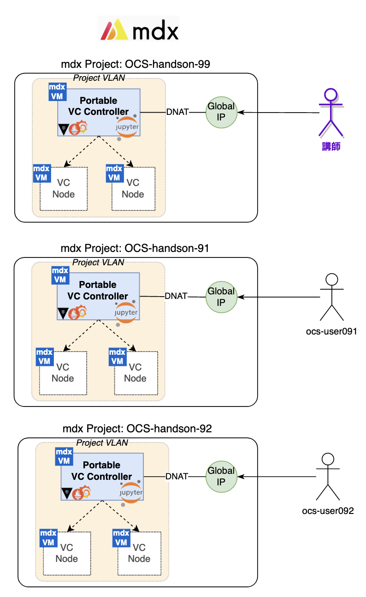

(2022-09-07 学認クラウドオンデマンド構築サービスセミナー)

# mdx と VCP ポータブル版によるオンデマンド構築サービスの活用

今回のハンズオンでは、mdx上に仮想マシンとして「VCP ポータブル版」を構築し、
VCコントローラの管理までの流れを確認します。
この環境を利用し、オンデマンド構築サービスの仕組みと基本的な使い方を実習します。

さらに、オンデマンド構築サービス上に「複数人で利用可能な軽量 Python 実習環境 (JupyterHub) 」
の配備と、そのカスタマイズ方法などについて実習します。

## 各実習ページへのリンク

### 1. VCPポータブル版の構築

[Setup-VCP-Portable.md](./Setup-VCP-Portable.md)

mdx上に「VCPポータブル版」を構築し、VCコントローラの管理手順を確認します。

1. mdxユーザポータルでの環境構築
    - mdxユーザポータルにアクセスし、mdx仮想マシンの作成とネットワーク設定を行います。

2. VCPポータブル版の実行
    - mdx仮想マシンにSSHでログインし、VCPポータブル版を起動します。

3. VCコントローラの管理
    - mdx仮想マシンにSSHでログインし、VCコントローラの管理コマンドを実行します。

### 2. Jupyter Notebook 入門

[JupyterNotebook_Introduction.ipynb](./JupyterNotebook_Introduction.ipynb)

Jupyter Notebookの基本操作と、NIIクラウド運用チームによるプラグイン拡張の一部について説明します。

### 3. mdx仮想マシンの準備

[mdx-001-mdx仮想マシンの準備.ipynb](mdx-001-mdx仮想マシンの準備.ipynb)

mdx REST API ClientのPythonライブラリを活用し、Jupyter Notebookからmdx仮想マシン (VM) を作成します。
そのmdx VMをVCノードとして使用するための準備を行います。

### 4. VCノードの起動、削除

[mdx-101-VCノードの起動、削除.ipynb](./mdx-101-VCノードの起動、削除.ipynb)

VCP SDKを利用してmdx上にVCノードを起動し、VCPの基本的な使い方を確認します。

### 5. VCP演習-JupyterHub

[mdx-403-VCP演習-JupyterHub.ipynb](./mdx-403-VCP演習-JupyterHub.ipynb)

VCPを活用したアプリケーションとして、The Littlest JupyterHub を構築します。

## ハンズオン環境概略図

