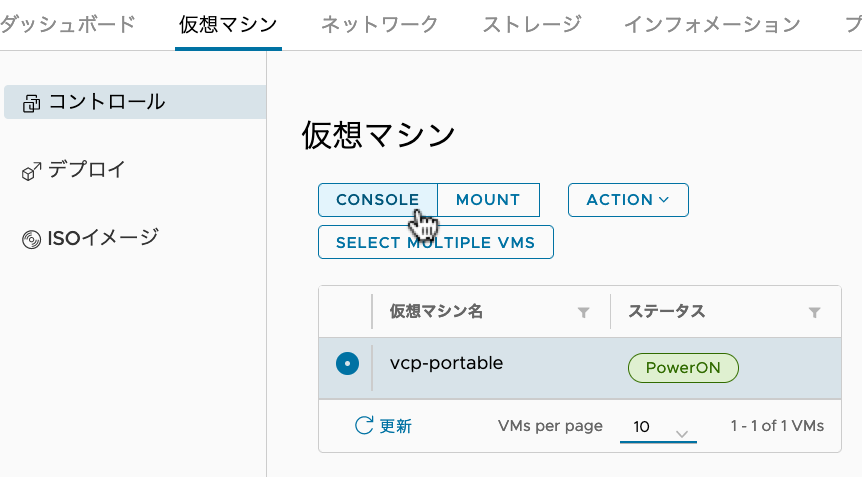

(2022-09-07 学認クラウドオンデマンド構築サービスセミナー)

# mdx と VCP ポータブル版によるオンデマンド構築サービスの活用

このドキュメントでは、mdx上に「VCPポータブル版」を構築し、VCコントローラの管理者としての作業ができるようになるまでの手順を記述しています。

1. mdxユーザポータルでの環境構築
    - mdxユーザポータルにアクセスし、mdx仮想マシンの作成とネットワーク設定を行います。
2. VCPポータブル版の実行
    - mdx仮想マシンにSSHでログインし、VCPポータブル版を起動します。
3. VCコントローラの管理
    - mdx仮想マシンにSSHでログインし、VCコントローラの管理コマンドを実行します。

## 1. mdxユーザポータルでの環境構築

### mdxローカル認証によるログイン

- ブラウザから <https://oprpl.mdx.jp> にアクセスしてください。ハンズオンでは「MDXローカル認証」を使用します。


- 実習参加者毎に割り当てられたユーザ名 (Username) と初期パスワード (Password) を入力します。


- 多要素認証アプリが発行する6桁のパスコードを入力します。
  * 初回接続時のパスコードは適当な6桁の数字を入力し、多要素認証用デバイスの登録を行います。


### mdx仮想マシン作成

- 仮想マシンテンプレートの一覧から、 `00_Ubuntu-2004-server` を選択し、「デプロイ」を実行します。


- デプロイする仮想マシンについて、ハードウェアのカスタマイズを行います。
  * パックタイプ: `CPUパック`
  * パック数: `3`
  * 仮想ディスク(GB): `64`
- 「公開鍵」は、ターミナルでSSHを使用してLinux（ハンズオンではmdxの仮想マシン）にログイン可能なPC環境において、作成済みのSSH鍵ペアがあればその公開鍵の内容を貼り付けます。
  * SSH鍵ペアが無い場合は、`ssh-keygen` コマンド等で作成してください。 e.g. `ssh-keygen -t ed25519`


- デプロイが開始すると、仮想マシンのステータスが「Deploying」となります。


- デプロイが完了すると、仮想マシンにプライベートIPv4アドレスが付与されるまで5分程度の時間を要します。


### mdx仮想マシンのアカウントパスワード設定

- 仮想マシンテンプレートにより、初回ログイン時にアカウントのパスワード設定が求められます。  
  ユーザポータルのコンソール機能を使って設定しておきます。
  * 後述のDNAT/ACL設定後に外部からSSH接続した場合も、同様に初回ログイン時にパスワード設定が必要です。

- 仮想マシンの CONSOLE を開きます。



- `mdxuser` でログインすると、パスワード設定が要求されます。
  - 一度設定すれば、次回以降はそのパスワードでログインできます。


### 外部ネットワークからのアクセス設定

- DNATの追加を行います。


- 「転送先プライベートIPアドレス」として、mdx仮想マシンの **サービスネットワーク1** で付与されたプライベート **IPv4アドレス** を入力します。


- 次の「ACL設定」で必要となる情報を取得するために、自身のプロジェクトに割り当てられた **IPアドレス範囲** を確認します。


- ACL設定により許可したい通信を設定します。


- ハンズオンで使用するアプリケーションのTCPポート番号として、 `22,80` をカンマ区切りでDstポートに入力します。
- Dstアドレスは、ネットワークセグメントの「IPアドレス範囲」で確認したアドレスを入力します。


- これで、ターミナルでSSHを使用してmdx仮想マシンにログイン可能となります。
  * ログインユーザ名 `mdxuser`
  
```
ssh mdxuser@{DNATのグローバルIPv4アドレス}
```


## 2. VCPポータブル版の実行

### GitHubリポジトリから必要なファイル群を取得

- mdx仮想マシンにSSHでログインし、<https://github.com/nii-gakunin-cloud/ocs-vcp-portable> を取得するために、以下のように `git clone` コマンドを実行します。
  * **注意:** ハンズオンでは mainブランチではなく、`handson2209` ブランチを指定してください。

```
git clone -b handson2209 https://github.com/nii-gakunin-cloud/ocs-vcp-portable.git
```

### セットアップスクリプト実行

- 以下のコマンドを実行します。完了までしばらく時間がかかります。
  * 最後に `setup was completed.` と出力されることを確認してください。

```
cd ocs-vcp-portable && ./mdx/init_mdx_pvcc.sh
```

- セットアップ・スクリプトにより以下のインストール、設定等が行われます。
  * Docker CE, Docker Composeインストール
  * Portable VCコントローラのコンテナイメージ取得、起動
  * Portable VCコントローラの初期設定
  * Jupyter Notebookサーバのコンテナイメージ取得、起動

- 正常終了すると、VCP REST API アクセストークンが `ocs-vcp-portable/tokenrc` ファイルに出力されます。

### 起動状態の確認

- `sudo docker-compose ps` コマンドを実行し、以下のように nginx, occtr の各サービスが起動していることを確認します。
  * **注意:** `docker-compose.yml` ファイルと同じカレントディレクトリで実行します。

```
mdxuser@ubuntu-2004:~/ocs-vcp-portable$ sudo docker-compose ps
          Name                     Command           State   Ports
------------------------------------------------------------------
ocs-vcp-portable_nginx_1   nginx -g daemon off;      Up           
ocs-vcp-portable_occtr_1   /usr/bin/supervisord -n   Up           
```

- `docker ps` コマンドを実行すると、上記に加えてJupyterNotebookコンテナを含む合計3つのコンテナが起動していることが確認できます。

#### （参考）VCPポータブル版が正常に起動しなかった場合に再構築するには

- VCPポータブル版をゼロから再構築したい場合は、`init_mdx_pvcc.sh` を再実行する前に以下のスクリプトを実行してください。

```
~/ocs-vcp-portable/cleanup-handson2209.sh
```

### Jupyter Notebook へのアクセス

- ブラウザから **`http://DNAT設定のグローバルIP/jupyter/`** にアクセスすると、VCPポータブル版と同じサーバで起動したJupyter Notebookにログインできます。

## 3. VCコントローラの管理

mdx上に構築したVCPポータブル版の管理手順を確認します。

### VC コントローラの停止方法

- 稼働中のVCコントローラを停止する必要がある場合、 `docker-compose down` コマンドを実行します。

```
sudo docker-compose down
```

```
# 実行例
mdxuser@ubuntu-2004:~/ocs-vcp-portable$ sudo docker-compose down
Stopping ocs-vcp-portable_nginx_1 ... done
Stopping ocs-vcp-portable_occtr_1 ... done
Removing ocs-vcp-portable_nginx_1 ... done
Removing ocs-vcp-portable_occtr_1 ... done

mdxuser@ubuntu-2004:~/ocs-vcp-portable$ sudo docker-compose ps
Name   Command   State   Ports
------------------------------
```

### VC コントローラの起動方法

- 停止中のVCコントローラを起動するには、 `docker-compose up -d` コマンドを実行します。

```
sudo docker-compose up -d
```

```
# 実行例
mdxuser@ubuntu-2004:~/ocs-vcp-portable$ sudo docker-compose up -d
Creating ocs-vcp-portable_occtr_1 ... done
Creating ocs-vcp-portable_nginx_1 ... done

mdxuser@ubuntu-2004:~/ocs-vcp-portable$ sudo docker-compose ps
          Name                     Command           State   Ports
------------------------------------------------------------------
ocs-vcp-portable_nginx_1   nginx -g daemon off;      Up           
ocs-vcp-portable_occtr_1   /usr/bin/supervisord -n   Up           
```

### VC コントローラを構成する各種サービスの起動

- VCコントローラを再起動した場合、Vaultサーバなどの必要な一連のサービスを開始する必要があります。
- VCコントローラのDockerコンテナに接続し、 `init.sh` スクリプトを実行します。

```
sudo docker-compose exec occtr ./init.sh
```

```
# 実行例
mdxuser@ubuntu-2004:~/ocs-vcp-portable$ sudo docker-compose exec occtr ./init.sh
rsyslogd: started
occtr_consul: started
redis: started
rqworkers:rqworker_update: started
rqworkers:rqworker_default0: started
rqworkers:rqworker_default1: started
serf: started
vault: started
prometheus: started
grafana: started
occtr: started
cron: started
+ for unseal_key in '$*'
+ VAULT_ADDR=https://localhost:8443
+ /usr/local/bin/vault unseal wIikcCQhsCa6JShsHHGLMvAzjNXY3zuC9f2Y7SzYv90=
Sealed: false
Key Shares: 1
Key Threshold: 1
Unseal Progress: 0
Unseal Nonce:
```

### VC コントローラを構成する各種サービスの起動状態確認

- VCコントローラ内のすべてのサービスが正常に起動していることを確認します。

```
sudo docker-compose exec occtr supervisorctl status
```

```
# 実行例
mdxuser@ubuntu-2004:~/ocs-vcp-portable$ sudo docker-compose exec occtr supervisorctl status
cron                             RUNNING   pid 129, uptime 0:00:20
grafana                          RUNNING   pid 94, uptime 0:00:22
occtr                            RUNNING   pid 103, uptime 0:00:21
occtr_consul                     RUNNING   pid 30, uptime 0:00:29
prometheus                       RUNNING   pid 84, uptime 0:00:23
redis                            RUNNING   pid 42, uptime 0:00:28
rqworkers:rqworker_default0      RUNNING   pid 47, uptime 0:00:26
rqworkers:rqworker_default1      RUNNING   pid 48, uptime 0:00:26
rqworkers:rqworker_update        RUNNING   pid 46, uptime 0:00:26
rsyslogd                         RUNNING   pid 25, uptime 0:00:30
serf                             RUNNING   pid 56, uptime 0:00:25
vault                            RUNNING   pid 71, uptime 0:00:24
```

### VCP REST API アクセストークン取得

- VCP SDKを利用する際に必要となる VCP REST API アクセストークンは、
  セットアップスクリプトが正常に実行されていれば、以下のテキストファイルで確認できます。

```
cat ~/ocs-vcp-portable/tokenrc
```

- 追加で別のトークンを取得する必要がある場合、以下のコマンドを実行することで何度でも発行することができます。
  * SINET関連施設にコントローラがある通常利用ケースでは、VC コントローラ管理者が VCP マネージャの Web UI にアクセスしてトークンの取得・管理を行いますが、ポータブル版ではコントローラに対してコマンドラインで発行要求を行います。

```
sudo docker-compose exec occtr ./create_token.sh
```

```
# 実行例
mdxuser@ubuntu-2004:~/ocs-vcp-portable$ sudo docker-compose exec occtr ./create_token.sh
09e06cb3-74a3-1c15-175f-2ae4e27a1d16
```

### VCコントローラのログ参照

- VCコントローラに対する REST API リクエストや処理のログは、Docker コンテナ・ホスト (今回の環境では mdx仮想マシン) のファイルシステムにある以下のファイルに保存されます。

```
tail ~/ocs-vcp-portable/volume/opt/occ/var/logs/application.log
```

