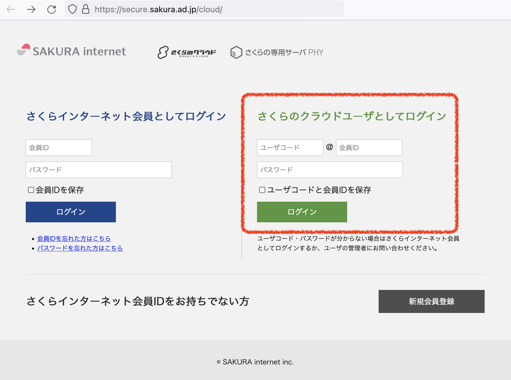
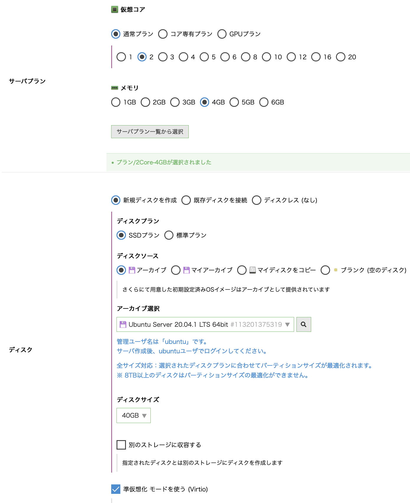
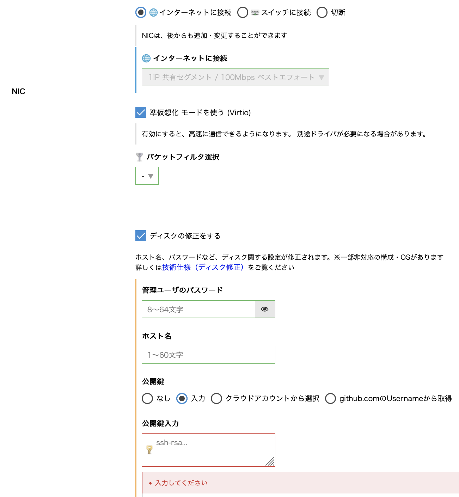
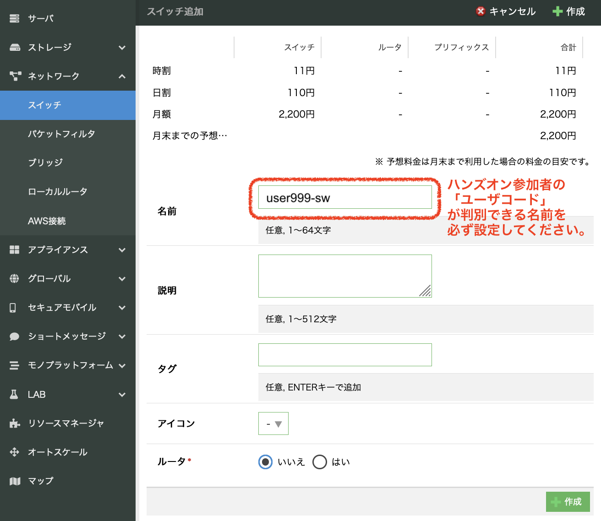
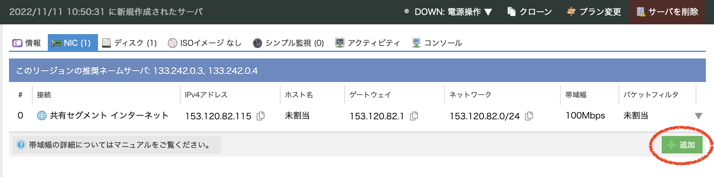
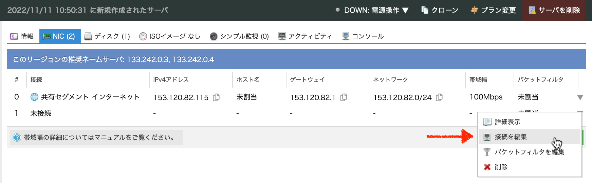

(2022-12-23 学認クラウドオンデマンド構築サービスセミナー)

# さくらのクラウドとVCPポータブル版によるオンデマンド構築サービスの活用

このドキュメントでは、さくらのクラウドに「VCPポータブル版」を構築し、VCコントローラの管理者としての作業ができるようになるまでの手順を記述しています。

1. さくらのクラウドでの環境構築
    - コントロールパネルへログインし、サーバの作成とネットワーク設定を行います。
2. VCPポータブル版の実行
    - 作成したサーバにSSHでログインし、VCPポータブル版を起動します。
3. VCコントローラの管理
    - VCPポータブル版において、VCコントローラの管理コマンド群を実行します。

## 1. さくらのクラウドでの環境構築

### (1) コントロールパネルへログイン

- ブラウザから <https://secure.sakura.ad.jp/cloud/> にアクセスしてください。
  * ハンズオンでは「さくらのクラウドユーザとしてログイン」を選択します。
  * 実習参加者に割り当てられたユーザコード、会員ID、パスワードを入力します。



### (2) サーバの作成

- VCコントローラ用のサーバを1個作成します。
  - ゾーン選択メニューより「東京第1ゾーン」を選択します。
  - 左側のメニューから「サーバ」をクリックして作成済みのサーバ一覧画面を表示し、「追加」をクリックします。
  - サーバの作成 <https://manual.sakura.ad.jp/cloud/server/create-delete.html#id3>

- サーバ追加画面の「シンプルモード」のチェックを外し、通常モードでサーバの仕様を設定します。




#### サーバプラン

- 通常プラン
- コア数: `2`
- メモリ: `4GB`

#### ディスク

- 新規ディスクを作成
- ディスクプラン: `SSDプラン`
- ディスクソース: `アーカイブ`
- アーカイブ選択: `Ubuntu Server 20.04.* LTS 64bit`
  * **注意** `(cloudimg)` 表記の **無いほう** を選択
- ディスクサイズ: `40GB`

#### NIC

-  インターネットに接続

#### ディスクの修正

- 公開鍵: `入力`
  * 公開鍵は、ターミナルでSSHを使用してLinux（さくらのクラウドの「サーバ」）にログイン可能なPC環境において、作成済みのSSH鍵ペアがあればその公開鍵の内容を貼り付けます。
  * SSH鍵ペアが無い場合は、例えば以下のように `ssh-keygen` コマンドで作成してください。
  
    ```
    ssh-keygen -t ed25519
    ```

### (3) スイッチの作成

- ローカルネットワーク用のスイッチを1個作成します。
  * ルータ機能は **不要**
  * スイッチの作成 <https://manual.sakura.ad.jp/cloud/network/switch/router-switch.html>




### (4) NICの追加、スイッチへの接続

- 作成したサーバに、NICを1個追加し、ローカルネットワーク用スイッチに接続します。
  * NICの追加 <https://manual.sakura.ad.jp/cloud/server/nic.html#id7>
  * NIC接続先の編集 <https://manual.sakura.ad.jp/cloud/server/nic.html#server-nic-edit>

- NICの追加画面


- NIC接続先の編集


- ローカルネットワーク用のスイッチを接続先として指定


### (5) 外部ネットワークからのSSH接続

- 作成したサーバにSSHを使用してログインします。
  * ログインユーザ名 `ubuntu`

```
ssh ubuntu@{サーバのグローバルIPアドレス}
```

### (6) NICへのプライベートIPアドレスの付与

- 追加したNICは、サーバのOSからは `eth1` として認識されています。  
  以下のように Netplan を用いてプライベートIPアドレスを付与します。

```
cat << EOF | sudo tee /etc/netplan/90-config.yaml
network:
  ethernets:
    eth1:
      addresses: [192.168.1.254/24]
EOF
sudo netplan apply
```

## 2. VCPポータブル版の実行

### GitHubリポジトリから必要なファイル一式を取得

- 作成したサーバにSSHでログインし、<https://github.com/nii-gakunin-cloud/ocs-vcp-portable> を取得するために、以下のように `git clone` コマンドを実行します。
  * **注意:** ハンズオンでは mainブランチではなく、`handson2212` ブランチを指定してください。

```
git clone -b handson2212 https://github.com/nii-gakunin-cloud/ocs-vcp-portable.git
```

### セットアップスクリプト実行

- 以下のコマンドを実行します。完了までしばらく時間がかかります。
  * 最後に `setup was completed.` と出力されることを確認してください。

```
cd ocs-vcp-portable && ./sakuracloud/init_sakura_pvcc.sh
```

- セットアップ・スクリプトにより以下のインストール、設定等が行われます。
  * Docker CE, Docker Composeインストール
  * Portable VCコントローラのコンテナイメージ取得、起動
  * Portable VCコントローラの初期設定
  * Jupyter Notebookサーバのコンテナイメージ取得、起動

- 正常終了すると、VCP REST API アクセストークンが `ocs-vcp-portable/tokenrc` ファイルに出力されます。

### 起動状態の確認

- `sudo docker-compose ps` コマンドを実行し、以下のように nginx, occtr の各サービスが起動していることを確認します。
  * **注意:** `docker-compose.yml` ファイルと同じカレントディレクトリで実行します。

```
ubuntu@pvcc:~/ocs-vcp-portable$ sudo docker-compose ps
          Name                     Command           State   Ports
------------------------------------------------------------------
ocs-vcp-portable_nginx_1   nginx -g daemon off;      Up           
ocs-vcp-portable_occtr_1   /usr/bin/supervisord -n   Up           
```

- `docker ps` コマンドを実行すると、上記に加えてJupyterNotebookコンテナを含む合計3つのコンテナが起動していることが確認できます。

#### （参考）VCPポータブル版が正常に起動しなかった場合に再構築するには

- VCPポータブル版をゼロから再構築したい場合は、`init_sakura_pvcc.sh` を再実行する前に以下のスクリプトを実行してください。

```
~/ocs-vcp-portable/cleanup-handson2212.sh
```

### Jupyter Notebook へのアクセス

- ブラウザから **`http://サーバのグローバルIP/jupyter/`** にアクセスすると、VCPポータブル版と同じサーバで起動したJupyter Notebookにログインできます。

## 3. VCコントローラの管理

さくらのクラウドで構築したVCPポータブル版の管理手順を確認します。

### VC コントローラの停止方法

- 稼働中のVCコントローラを停止する必要がある場合、 `docker-compose down` コマンドを実行します。

```
sudo docker-compose down
```

```
# 実行例
ubuntu@pvcc:~/ocs-vcp-portable$ sudo docker-compose down
Stopping ocs-vcp-portable_nginx_1 ... done
Stopping ocs-vcp-portable_occtr_1 ... done
Removing ocs-vcp-portable_nginx_1 ... done
Removing ocs-vcp-portable_occtr_1 ... done

ubuntu@pvcc:~/ocs-vcp-portable$ sudo docker-compose ps
Name   Command   State   Ports
------------------------------
```

### VC コントローラの起動方法

- 停止中のVCコントローラを起動するには、 `docker-compose up -d` コマンドを実行します。

```
sudo docker-compose up -d
```

```
# 実行例
ubuntu@pvcc:~/ocs-vcp-portable$ sudo docker-compose up -d
Creating ocs-vcp-portable_occtr_1 ... done
Creating ocs-vcp-portable_nginx_1 ... done

ubuntu@pvcc:~/ocs-vcp-portable$ sudo docker-compose ps
          Name                     Command           State   Ports
------------------------------------------------------------------
ocs-vcp-portable_nginx_1   nginx -g daemon off;      Up           
ocs-vcp-portable_occtr_1   /usr/bin/supervisord -n   Up           
```

### VC コントローラを構成する各種サービスの起動

- VCコントローラを再起動した場合、Vaultサーバなどの必要な一連のサービスを開始する必要があります。
- VCコントローラのDockerコンテナに接続し、 `init.sh` スクリプトを実行します。

```
sudo docker-compose exec occtr ./init.sh
```

```
# 実行例
ubuntu@pvcc:~/ocs-vcp-portable$ sudo docker-compose exec occtr ./init.sh
rsyslogd: started
occtr_consul: started
redis: started
rqworkers:rqworker_update: started
rqworkers:rqworker_default0: started
rqworkers:rqworker_default1: started
serf: started
vault: started
prometheus: started
grafana: started
occtr: started
cron: started
+ for unseal_key in '$*'
+ VAULT_ADDR=https://localhost:8443
+ /usr/local/bin/vault unseal wIikcCQhsCa6JShsHHGLMvAzjNXY3zuC9f2Y7SzYv90=
Sealed: false
Key Shares: 1
Key Threshold: 1
Unseal Progress: 0
Unseal Nonce:
```

### VC コントローラを構成する各種サービスの起動状態確認

- VCコントローラ内のすべてのサービスが正常に起動していることを確認します。

```
sudo docker-compose exec occtr supervisorctl status
```

```
# 実行例
ubuntu@pvcc:~/ocs-vcp-portable$ sudo docker-compose exec occtr supervisorctl status
cron                             RUNNING   pid 129, uptime 0:00:20
grafana                          RUNNING   pid 94, uptime 0:00:22
occtr                            RUNNING   pid 103, uptime 0:00:21
occtr_consul                     RUNNING   pid 30, uptime 0:00:29
prometheus                       RUNNING   pid 84, uptime 0:00:23
redis                            RUNNING   pid 42, uptime 0:00:28
rqworkers:rqworker_default0      RUNNING   pid 47, uptime 0:00:26
rqworkers:rqworker_default1      RUNNING   pid 48, uptime 0:00:26
rqworkers:rqworker_update        RUNNING   pid 46, uptime 0:00:26
rsyslogd                         RUNNING   pid 25, uptime 0:00:30
serf                             RUNNING   pid 56, uptime 0:00:25
vault                            RUNNING   pid 71, uptime 0:00:24
```

### VCP REST API アクセストークン取得

- VCP SDKを利用する際に必要となる VCP REST API アクセストークンは、
  セットアップスクリプトが正常に実行されていれば、以下のテキストファイルで確認できます。

```
cat ~/ocs-vcp-portable/tokenrc
```

- 追加で別のトークンを取得する必要がある場合、以下のコマンドを実行することで何度でも発行することができます。
  * SINET関連施設にコントローラがある通常利用ケースでは、VC コントローラ管理者が VCP マネージャの Web UI にアクセスしてトークンの取得・管理を行いますが、ポータブル版ではコントローラに対してコマンドラインで発行要求を行います。

```
sudo docker-compose exec occtr ./create_token.sh
```

```
# 実行例
ubuntu@pvcc:~/ocs-vcp-portable$ sudo docker-compose exec occtr ./create_token.sh
09e06cb3-74a3-1c15-175f-2ae4e27a1d16
```

### VCコントローラのログ参照

- VCコントローラに対する REST API リクエストや処理のログは、Docker コンテナ・ホスト (今回の環境ではさくらのクラウドのサーバ) のファイルシステムにある以下のファイルに保存されます。

```
tail ~/ocs-vcp-portable/volume/opt/occ/var/logs/application.log
```

