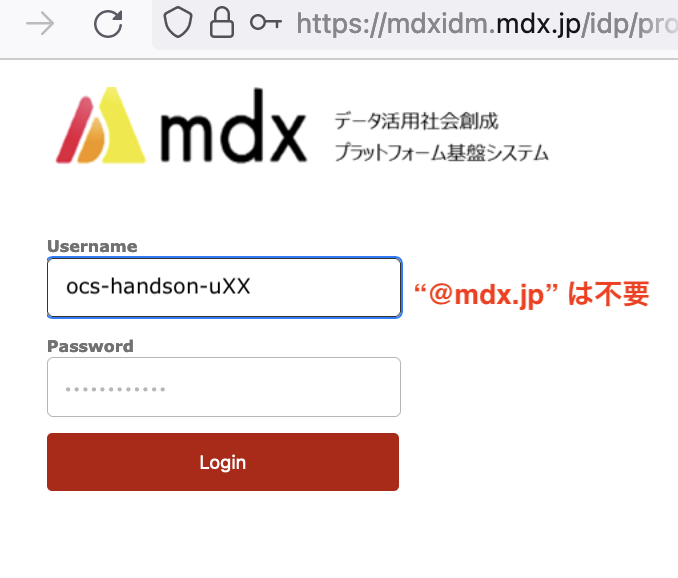

# mdx ユーザポータルへのログイン

- ブラウザから <https://oprpl.mdx.jp> にアクセスしてください。ハンズオンでは「MDXローカル認証」を使用します。

- 実習参加者毎に割り当てられたユーザ名 (Username) と初期パスワード (Password) を入力します。

- 多要素認証アプリが発行する6桁のパスコードを入力します。
  * 初回接続時のパスコードは適当な6桁の数字を入力し、多要素認証用デバイスの登録を行います。

