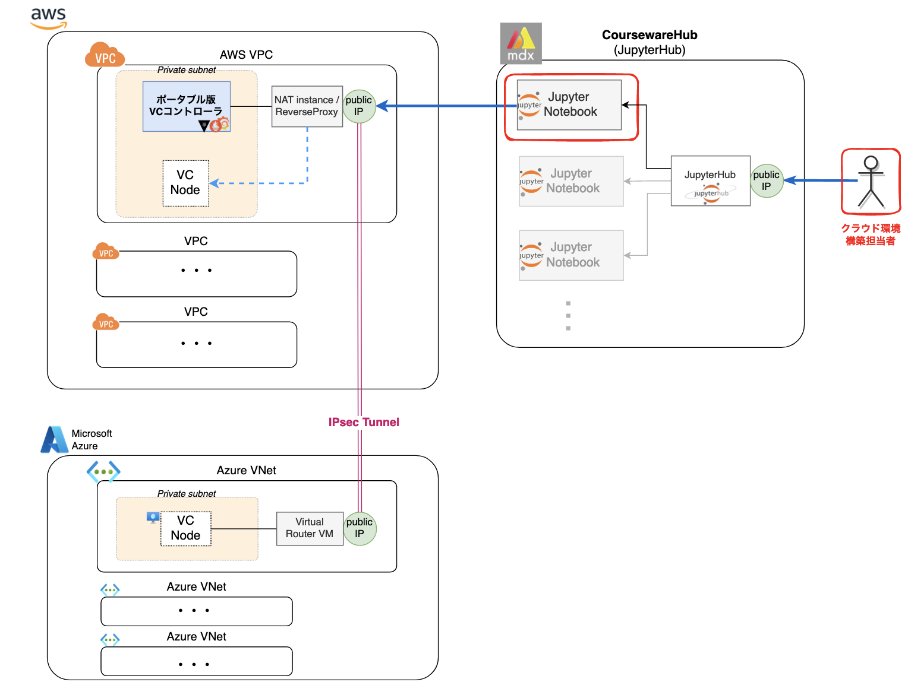

(2024-02 学認クラウドオンデマンド構築サービスセミナー)

# VCPを用いたHPCクラスタ用WebポータルOpen OnDemandの構築と活用

今回のハンズオンでは、オンデマンド構築サービスの仕組みと基本的な使い方を実習し、
VCPを活用したアプリケーションとして、HPCクラスタの計算資源を簡易に利用可能にする
Webポータル「Open OnDemand」を構築します。

Open OnDemandとHPCクラスタを活用し、LinpackベンチマークとJupyterNotebookサーバをHPCジョブとして実行します。

## 各実習ページへのリンク

### 1. Jupyter Notebook 入門

[JupyterNotebook_Introduction.ipynb](./JupyterNotebook_Introduction.ipynb)

Jupyter Notebookの基本操作と、NIIクラウド運用チームによるプラグイン拡張の一部について説明します。

### 2. VCノードの起動、削除

[101-VCノードの起動、削除.ipynb](./101-VCノードの起動、削除.ipynb)

VCP SDKを利用してmdx上にVCノードを起動し、VCPの基本的な使い方を確認します。

### 4. VCP演習: HPCクラスタ用Webポータル「Open OnDemand」の活用
 
#### 4-1. HPCクラスタ構築

最初にOpenHPC-v2テンプレートを用いてOpenHPC/Slurmクラスタを作成します。

- [OpenHPC-v2/000-README](./OpenHPC-v2/000-README.ipynb)  
  「作業用Notebookの作成」の手順に従い、以下のNotebookを実行します。
  - 010: パラメータ設定
  - 020: OpenHPCの起動

#### 4-2. Open OnDemand構築

HPCクラスタのマスターノード上にOpen OnDemandを構築します。

- [OpenOnDemand/010-インストール](OpenOnDemand/010-インストール.ipynb)
- [OpenOnDemand/020-フロントエンドのセットアップ](OpenOnDemand/020-フロントエンドのセットアップ.ipynb)
- [OpenOnDemand/030-ジョブ実行環境の設定](OpenOnDemand/030-ジョブ実行環境の設定.ipynb)
- [OpenOnDemand/040-ジョブの実行](OpenOnDemand/040-ジョブの実行.ipynb)

#### 4-3. Open OnDemandの活用

HPCクラスタとOpen OnDemandを活用し、HPCジョブとしてLinpackベンチマーク、JupyterNotebookサーバを実行します。

- [OpenOnDemand/050-JupyterNotebookのセットアップ](OpenOnDemand/050-JupyterNotebookのセットアップ.ipynb)
- [OpenOnDemand/060-JupyterNotebookジョブの実行](OpenOnDemand/060-JupyterNotebookジョブの実行.ipynb)
- [OpenOnDemand/070-Linpackフロントエンドの作成](OpenOnDemand/070-Linpackフロントエンドの作成.ipynb)
- [OpenOnDemand/080-Linpackの実行](OpenOnDemand/080-Linpackの実行.ipynb)

## ハンズオン環境概略図

